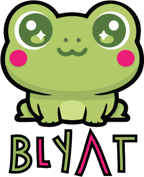

<p align="center">
  
</p>

**Blyat** is a programming language designed by **Raphaëlle Wats** to implement the **receptor model**.

The **receptor model** is similar to the **active object model**, but it makes a different set of trade-offs:

- **Active object paradigm**: each object instance owns a **thread** that processes **messages** and dispatches **methods**.
- **Receptor paradigm**: receptor instances do **not** own threads. Instead, a **runtime thread pool** processes **messages** and dispatches **behaviors**.

In **Blyat**, concurrency is handled by the **runtime**, not the developer.  
The runtime determines when and where **behaviors** are triggered. Meanwhile, the operating system can parallelize execution across CPU cores.  

This allows the same **Blyat** program to run on a single-core machine or a highly parallel system without modification. *Scalability emerges from the runtime, not the program structure*, simplifying concurrency reasoning and avoiding low-level thread management.


# Sample
```c
receptor Ping
{
    structure {
        Int count;
    }

    mold (Int n) {
        self.count = n;
    }

    upon start(Pong target) {
        to target emit >ping(myself);
    }

    upon pong(Int amount) {
        self.count += amount;
    }
}

receptor Pong
{
    structure {
        Int count;
    }

    mold () {
        self.count = 0;
    }

    upon ping(Ping src) {
        self.count += 1;
        to src emit >pong(self.count);
    }
}
```